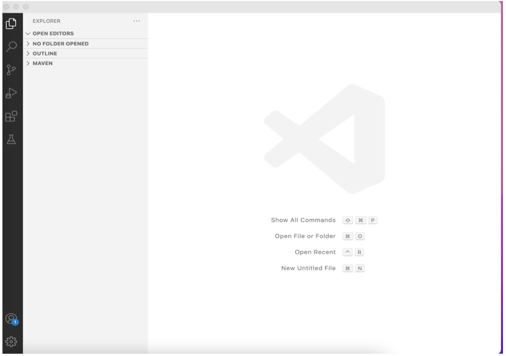
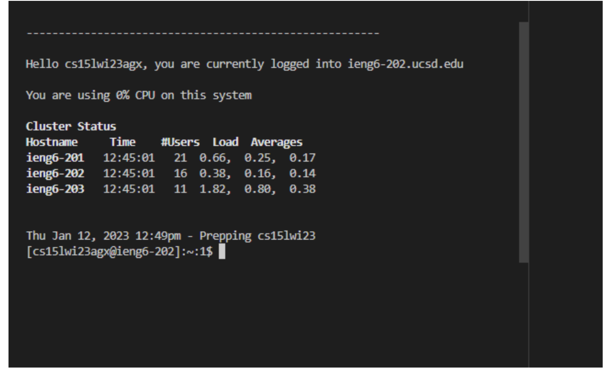
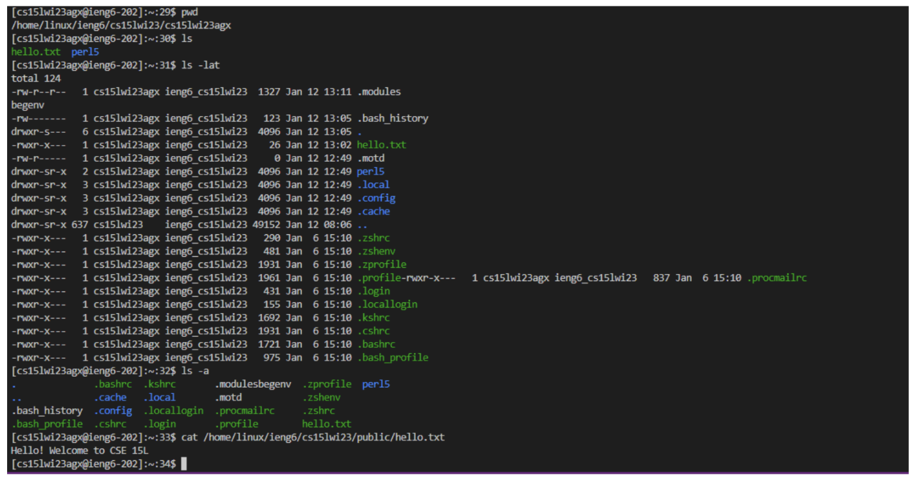

# Lab Report 1

## 1. Visual Studio Code

- First, go to the Visual Studio Code [website](https://code.visualstudio.com/) to download and install the Visual Studio Code on your computer. 
- Remember: Downloading correct version for your operating system is important!
- Once the Visual Studio Code is installed successfully, it should be look like this when you open it:




## 2. Remotely Connecting

- First, using the [Link](https://sdacs.ucsd.edu/~icc/index.php) to look up your course-specific account for CSE 15.
- Here is the [tutorial](https://docs.google.com/document/d/1hs7CyQeh-MdUfM9uv99i8tqfneos6Y8bDU0uhn1wqho/edit) that helps you reset your password for the course-specific account.
- Remember: It may take a few miniutes for the account and password to update and work!
- Then, in the environment of Windows system, install Git from the [website](https://gitforwindows.org/).
- After successfully installation, following the steps in this [post](https://gitforwindows.org/) to use git bash in Visual Studio Code.
- Now, open the terminal in VScode(Ctrl or Command + `, or use the Terminal → New Terminal menu option). 
- Type the following in the terminal, but replace ```zz``` by the letters in your course-specific account.
 
  ```$ ssh cs15lwi23zz@ieng6.ucsd.edu``` 
  
- Remember: It should be one, five, l - the lower case of L! And you do not need to type ```$``` in!
- After that, you might see the following message, 

```
⤇ ssh cs15lwi23zz@ieng6.ucsd.edu 
The authenticity of host 'ieng6.ucsd.edu (128.54.70.227)' can't be established.
RSA key fingerprint is SHA256:ksruYwhnYH+sySHnHAtLUHngrPEyZTDl/1x99wUQcec.
Are you sure you want to continue connecting (yes/no/[fingerprint])?
```
NO WORRIES! Since it might be your first time to connect to this server. 
- What you need to do next is just type ```yes``` and press enter.
- After that, once you see ```Password:``` show up, then type the password of your course-specific account in the terminal. 
- If you're successfully logged in, you should see see something like this: 



## 3. Trying Some Commands

- Now, let's try run some different commands on the remote computer using the terminal in VScode.
- Here are some examples that you can try: 

1. ```pwd```(This command prints current working directory)

2. ```ls```(This command lists the files and folders the given path)

3. ```ls -lat```(This command displays all the files and folders by the given path in a long listing format and sort by modification time)

4. ```ls -a```(This command displays all the files including hidden files in the given path)

5. ```cat /home/linux/ieng6/cs15lwi23/public/hello.txt``` (This command prints the contents of files in the given path)

Here is the example of what these commands should be look like:

 

- Finally, if you want to log out of your remote connecting in your terminal, try using these:
1. press Ctrl-D
2. type ```exit```

（Either one of these steps can log out of your remote connecting easily!)

Interesting! Even we are physically distant, we are still able to manipulate another computer through remote connecting steps exhibited above. More importantly, by typing serveral simple letters, you can not only easily access and see the contents of files that saved in the remote computer, but also get a whole list of files sort by time. Those above are all useful commands that you should try on your own!
