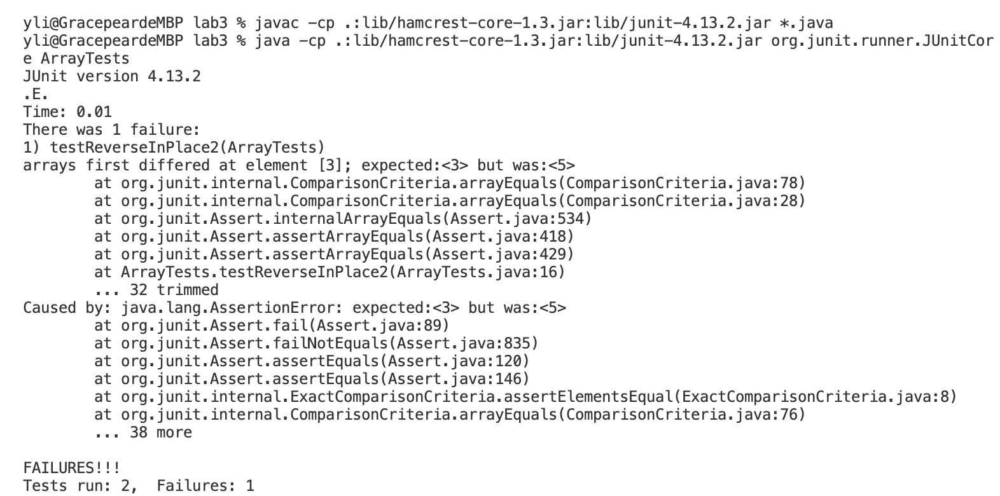

# Lab Report 2

# Part 1

## The code for StringServer
```
import java.io.IOException;
import java.net.URI;

class Handler implements URLHandler {
    String words = "";

    public String handleRequest(URI url) {
        System.out.println("Path: " + url.getPath());
        if (url.getPath().contains("/add-message")) {
            String[] parameters = url.getQuery().split("=");
            if (parameters[0].equals("s")) {
                words = words + parameters[1] + "\n";
            }
            return words;
        }
        else {
            return "  ";
        }
    }

}
class StringServer{
    public static void main(String[] args) throws IOException {
        if(args.length == 0){
            System.out.println("Missing words! Try any word");
            return;
        }
        int port = Integer.parseInt(args[0]);
        Server.start(port, new Handler());
    }
}

  ```

## First screenshot of using /add-message


## Which methods in your code are called?

The methods of handleRequest, getPath, contains, getQuery, split, equals, and start are called.

## What are the relevant arguments to those methods, and the values of any relevant fields of the class?

1. The relevant argument to handleRequest is url in type URI, the value should be new URI("localhost:4000/add-message?s=Hello").
2. There is no argument that was passed into the method of getPath, but its output value should be the string that contains the part of the url after the domain and before any ?.
3. The relevant argument and value to the method of contains are "/add-message" in type of String.
4. There is no argument that was passed into the method of getQuery, but its output value should be the string that contains the part of the url after the first ? and before the anchor.
5. The relevant argument and value to the method of split are the "=" in type of String.
6. The relevant argument and value to the method of equals are the "s" in type of String.
7. The relevant argument and value to the method of start are port in type of Integer and the new Handler().

## How do the values of any relevant fields of the class change from this specific request? If no values got changed, explain why.

1. The value of handleRequest is localhost:4000/add-message?s=Hello in type URI.
2. The method of getPath extracts the part of url (localhost:4000/add-message?s=Hello) after the domain and before any ? and return the extracted part into a String type. Thus, its output value becomes "/add-message" in type of String.
3. The value of contains is still "/add-message" in type of String, as this method is mainly for checking whether the extracted Path contains "/add-message". If the method of contains works and the extracted path does contain "/add-message", then url will be used again in the next line of codes under if statement.
4. The method of getQuery extracts the part of url (localhost:4000/add-message?s=Hello) after the first ? and before the anchor and return the extracted part into a String type. Thus, its output value becomes "s=Hello" in type of String.
5. The value of split is still "=" in type of String, as this method is mainly for spliting the Query by "=". Then, by creating a Stringlist-parameters, the string "s" before "=" in Query part becomes an element in parameters at index 0, and the string "Hello" after "=" becomes an element in parameters at index 1.
6. The value of equals is still "s" in type of String, because this method is mainly for checking whether the Query is in a supporting form. Therefore, if the element in parameters at index 0 equals "s", then the element "Hello" in parameters at index 1 will be used in the next line of codes under if statement.

Based on above stpes, once the form of url passes two if statements, then the extracted String element "Hello" from url in parameters at index 1 will be added to an empty string ```words``` in a new line.

7. The value of start in port becomes the Integer.parseInt(args[0]) based on the input.


## Second screenshot of using /add-message


## Which methods in your code are called?

The methods of handleRequest, getPath, contains, getQuery, split, equals, and start are called.

## What are the relevant arguments to those methods, and the values of any relevant fields of the class?

1. The relevant argument to handleRequest is url in type URI, the value should be new URI("localhost:4000/add-message?s=How are you?").
2. There is no argument that was passed into the method of getPath, but its output value should be the string that contains the part of the url after the domain and before any ?.
3. The relevant argument and value to the method of contains are "/add-message" in type of String.
4. There is no argument that was passed into the method of getQuery, but its output value should be the string that contains the part of the url after the first ? and before the anchor.
5. The relevant argument and value to the method of split are the "=" in type of String.
6. The relevant argument and value to the method of equals are the "s" in type of String.
7. The relevant argument and value to the method of start are port in type of Integer and the new Handler().

## How do the values of any relevant fields of the class change from this specific request? If no values got changed, explain why.

1. The value of handleRequest is localhost:4000/add-message?s=How are you? in type URI.
2. The method of getPath extracts the part of url (localhost:4000/add-message?s=How are you?) after the domain and before any ? and return the extracted part into a String type. Thus, its output value becomes "/add-message" in type of String.
3. The value of contains is still "/add-message" in type of String, as this method is mainly for checking whether the extracted Path contains "/add-message". If the method of contains works and the extracted path does contain "/add-message", then url will be used again in the next line of codes under if statement.
4. The method of getQuery extracts the part of url (localhost:4000/add-message?s=How are you?) after the first ? and before the anchor and return the extracted part into a String type. Thus, its output value becomes "s=How are you?" in type of String.
5. The value of split is still "=" in type of String, as this method is mainly for spliting the Query by "=". Then, by creating a Stringlist-parameters, the string "s" before "=" in Query part becomes an element in parameters at index 0, and the string "How are you?" after "=" becomes an element in parameters at index 1.
6. The value of equals is still "s" in type of String, because this method is mainly for checking whether the Query is in a supporting form. Therefore, if the element in parameters at index 0 equals "s", then the element "How are you?" in parameters at index 1 will be used in the next line of codes under if statement.

Based on above stpes, once the form of url passes two if statements, then the extracted String element "How are you?" from url in parameters at index 1 will be added to an empty string ```words``` in a new line.

7. The value of start in port becomes the Integer.parseInt(args[0]) based on the input.

# Part 2

## The bug from reverseInPlace method in ArrayExamples.java

Original codes for reverseInPlace method:
```
static void reverseInPlace(int[] arr) {
    for(int i = 0; i < arr.length; i += 1) {   
      arr[i] = arr[arr.length - i - 1];
    }
}
```

## 1. A failure-inducing input for the buggy program

The JUnit test:
```
@Test
public void testReverseInPlace2() {
    int[] input2 = {2,3,4,5,0};
    ArrayExamples.reverseInPlace(input2);
    assertArrayEquals(new int[]{0,5,4,3,2}, input2);
}
```
The input is {2,3,4,5,0}

The expected output is {0,5,4,3,2} 

The actual output is {0,5,4,5,0}

## 2. An input that doesn’t induce a failure

The JUnit test:
```
@Test
public void testReverseInPlace() { 
    int[] input1 = {0};    
    ArrayExamples.reverseInPlace(input1);    
    assertArrayEquals(new int[]{0}, input1);    
}
  ```
The input is {0}

The expected output is {0} 

The actual output is {0}

## 3. The symptom, as the output of running the tests 
 
 The output of running the test:
 
 
 One test (testReverseInPlace) passed successfully and one test (testReverseInPlace2) failed.
 
 From testReverseInPlace2, we can tell the element from updated arr begins to be incorrect since certain index position. This says, when the for loop iterates to a certain i(the index position of arr), ```arr[i] = arr[arr.length - i - 1]``` starts to make the mistake and caused the problem of the wrong output. To fix the problem, we need to focus on changing the code ```arr[i] = arr[arr.length - i - 1]``` and find a correct way to sequentially place each element from each index in a reversing order.
 
## 4. The bug, as the before-and-after code change required to fix it

The before-code:
```
static void reverseInPlace(int[] arr) {
    for(int i = 0; i < arr.length; i += 1) {   
      arr[i] = arr[arr.length - i - 1];
    }
}
```

The after-code that fix the bug:
```
static void reverseInPlace(int[] arr) {
    int[] newArray = new int[arr.length];
    for (int i = 0; i < arr.length; i += 1) {
      newArray[i] = arr[i];
    }
    for(int i = 0; i < arr.length; i += 1) {
      arr[i] = newArray[arr.length - i - 1];
    }
}
 ```
When this method iterates through every element in the arr and place each of them by reversing order, it also changes the value of each element at original index of the arr. This says, when we try to replace elements ```arr[i]``` in first several index positions using the elements ```arr[arr.length - i - 1]``` from last several index, we also lost the original elements that stored in first several index positions from arr. As a result, when ```i``` becomes larger, we are unable to retrieval those being replaced and original elements and put them to the reversing index positions. In other words, as the for loop iterates to a certain index position, ```arr[arr.length - i - 1]``` will begin to extract elements that are being updated already, which are not the same elements exist in original arr anymore. Therefore, the reverseInPlace method is buggy, in which its updated arr will contain different elements from our expectation. Thus, to fix the problem, we first need to make a newArray that contains all the elements in arr with the same length. By this way, we can deeply copy the input - arr and make sure all the elements that we extract later will be in their original order. Then to change the order of elements, we can employ for loop to iterate through all the elements that saved in newArray in reversing order and replace them sequentially in arr.
(There is another solution to fix this problem! But the only way I can think of is creating a new array).

# Part 3
One thing I learned from Lab 2 was that we can literaly write a web server using java in Visual Studio Code. More interestingly, we can write
specific codes to make web server support the path and behavior based on what we want to display. What's more, except running web server on
our local machine, we can also run it remotely, this says we can also access the web server using remote computers, which is very cool to learn.

