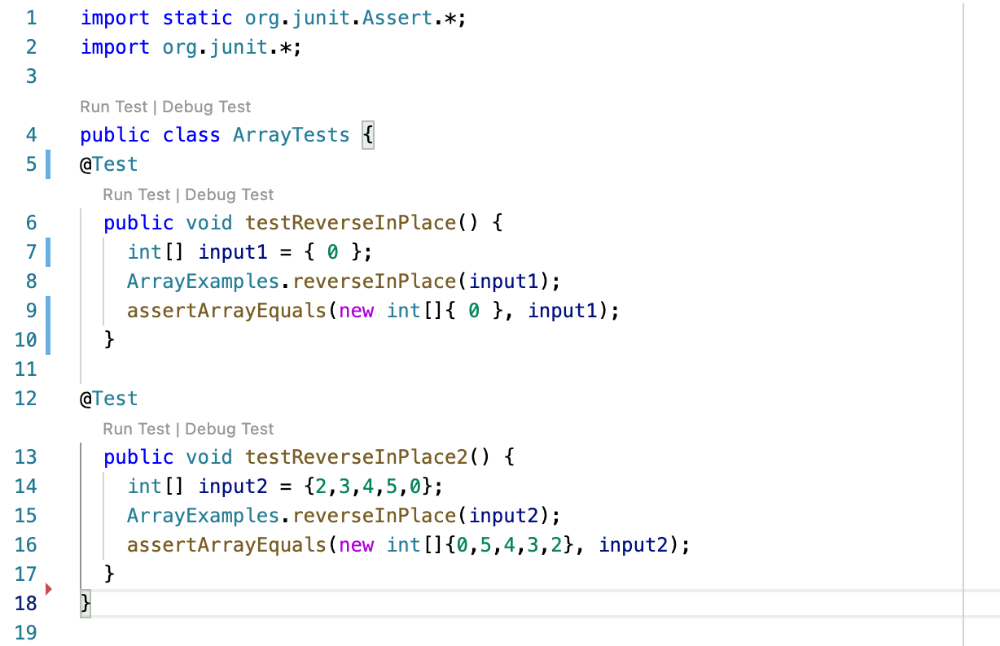

# Lab Report 1

# Part 1

## The code for StringServer
```
import java.io.IOException;
import java.net.URI;

class Handler implements URLHandler {
    String words = "";

    public String handleRequest(URI url) {
        System.out.println("Path: " + url.getPath());
        if (url.getPath().contains("/add-message")) {
            String[] parameters = url.getQuery().split("=");
            if (parameters[0].equals("s")) {
                words = words + parameters[1] + "\n";
            }
            return words;
        }
        else {
            return "  ";
        }
    }

}
class StringServer{
    public static void main(String[] args) throws IOException {
        if(args.length == 0){
            System.out.println("Missing words! Try any word");
            return;
        }
        int port = Integer.parseInt(args[0]);
        Server.start(port, new Handler());
    }
}

  ```

## First screenshot of using /add-message


## Which methods in your code are called?

The methods of handleRequest, getPath, contains, getQuery, split, equals, and start are called.

## What are the relevant arguments to those methods, and the values of any relevant fields of the class?

1. The relevant argument to handleRequest is url in type URI, the value should be new URI("http://localhost:4000/add-message?s=Hello").
2. The relevant argument to getPath is the url in type URI and the value is same from 1, but its output value should be the string that contains the part of the url after the domain and before any ?.
3. The relevant argument and value to the method of contains are "/add-message" in type of String.
4. The relevant argument to getQuery is the url in type URI and the value is same from 1, but its output value should be the string that contains the part of the URL after the first ? and before the anchor.
5. The relevant argument and value to the method of split are the "=" in type of String.
6. The relevant argument and value to the method of equals are the "s" in type of String.
7. The relevant argument and value to the method of start are port in type of Integer and the new Handler().

## How do the values of any relevant fields of the class change from this specific request? If no values got changed, explain why.

1. The value of handleRequest becomes localhost:4000/add-message?s=Hello in type URI.
2. The value of getPath becomes localhost:4000/add-message?s=Hello in type URI, and its output value becomes "/add-message".
3. The value of contains is still "/add-message" in type of String, because this method is mainly for checking whether the Path contains "/add-message".
4. The value of getQuery becomes localhost:4000/add-message?s=Hello in type URI, and its output value becomes "s=Hello".
5. The value of split is still "=" in type of String, because this method is mainly for spliting the Query by "=".
6. The value of equals is still "s" in type of String, because this method is mainly for checking whether the Query is in a supporting form.
7. The value of start in port becomes the Integer.parseInt(args[0]) based on the input.


## Second screenshot of using /add-message


## Which methods in your code are called?

The methods of handleRequest, getPath, contains, getQuery, split, equals are called.

## What are the relevant arguments to those methods, and the values of any relevant fields of the class?

1. The relevant argument to handleRequest is url in type URI, the value should be new URI("http://localhost:4000/add-message?s=How are you?").
2. The relevant argument to getPath is the url in type URI and the value is same from 1, but its output value should be the string that contains the part of the url after the domain and before any ?.
3. The relevant argument and value to the method of contains are "/add-message" in type of String.
4. The relevant argument to getQuery is the url in type URI and the value is same from 1, but its output value should be the string that contains the part of the URL after the first ? and before the anchor.
5. The relevant argument and value to the method of split are the "=" in type of String.
6. The relevant argument and value to the method of equals are the "s" in type of String.
7. The relevant argument and value to the method of start are port in type of Integer and the new Handler().

## How do the values of any relevant fields of the class change from this specific request? If no values got changed, explain why.

1. The value of handleRequest becomes localhost:4000/add-message?s=How are you? in type URI.
2. The value of getPath becomes localhost:4000/add-message?s=How are you? in type URI, and its output value becomes "/add-message".
3. The value of contains is still "/add-message" in type of String, because this method is mainly for checking whether the Path contains "/add-message".
4. The value of getQuery becomes localhost:4000/add-message?s=Hello in type URI, and its output value becomes "s=How are you?".
5. The value of split is still "=" in type of String, because this method is mainly for spliting the Query by "=".
6. The value of equals is still "s" in type of String, because this method is mainly for checking whether the Query is in a supporting form.
7. 7. The value of start in port becomes the Integer.parseInt(args[0]) based on the input.

# Part 2

## The bug from reverseInPlace method in ArrayExamples.java

Original codes for reverseInPlace method:
```
static void reverseInPlace(int[] arr) {
    for(int i = 0; i < arr.length; i += 1) {   
      arr[i] = arr[arr.length - i - 1];
    }
}
```

## 1. A failure-inducing input for the buggy program

The JUnit test:
```
@Test
public void testReverseInPlace2() {
    int[] input2 = {2,3,4,5,0};
    ArrayExamples.reverseInPlace(input2);
    assertArrayEquals(new int[]{0,5,4,3,2}, input2);
}
```
The input is {2,3,4,5,0}

The expected output is {0,5,4,3,2} 

The actual output is {0,5,4,5,0}

## 2. An input that doesn’t induce a failure

The JUnit test:
```
@Test
public void testReverseInPlace() { 
    int[] input1 = {0};    
    ArrayExamples.reverseInPlace(input1);    
    assertArrayEquals(new int[]{0}, input1);    
}
  ```
The input is {0}

The expected output is {0} 

The actual output is {0}

## 3. The symptom, as the output of running the tests 
 
 Using the two inputs above:
 
 
 The output of running the test:
 
 
 One test (testReverseInPlace) passed successfully and one test (testReverseInPlace2) failed.
 
## 4. The bug, as the before-and-after code change required to fix it

The before-code:
```
static void reverseInPlace(int[] arr) {
    for(int i = 0; i < arr.length; i += 1) {   
      arr[i] = arr[arr.length - i - 1];
    }
}
```

The after-code that fix the bug:
```
static void reverseInPlace(int[] arr) {
    int[] newArray = new int[arr.length];
    for (int i = 0; i < arr.length; i += 1) {
      newArray[i] = arr[i];
    }
    for(int i = 0; i < arr.length; i += 1) {
      arr[i] = newArray[arr.length - i - 1];
    }
}
 ```
The reason why the reverseInPlace method is buggy is mainly becuase when it iterates through every element in the arr by reversing order, 
the element in arr in each index is also changed accordingly. So the elements we get from arr during for loop is no longer in their original 
order or position. Thus, to fix the problem, we first need to make a newArray that contains all the elements in arr with the same length. By 
this way, we can deeply copy the input - arr and make sure all the elements that we extract later will be in their original order. Then to 
change the order of elements, we can employ for loop to iterate through all the elements that saved in newArray in reversing order and 
replace them sequentially in arr.

# Part 3
One thing I learned from Lab 2 was that we can literaly write a web server using java in Visual Studio Code. More interestingly, we can write
specific codes to make web server support the path and behavior based on what we want to display. What's more, except running web server on
our local machine, we can also run it remotely, this says we can also access the web server using remote computers, which is very cool to learn.

